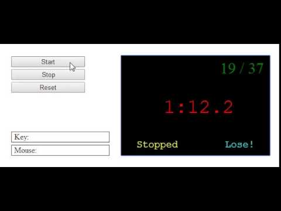

# Welcome to 'Stopwatch'

*Stars, Forks and Pull Requests are welcome :)*

The game
-------
A stopwatch is a handheld timepiece designed to measure the amount of time elapsed from a particular time when it is activated to the time when the piece is deactivated. A large digital version of a stopwatch designed for viewing at a distance, as in a sports stadium, is called a stopclock.

A typical mechanical analog stopwatch.
The timing functions are traditionally controlled by two buttons on the case. Pressing the top button starts the timer running, and pressing the button a second time stops it, leaving the elapsed time displayed. A press of the second button then resets the stopwatch to zero. The second button is also used to record split times or lap times. When the split time button is pressed while the watch is running, the display freezes, allowing the elapsed time to that point to be read, but the watch mechanism continues running to record total elapsed time. Pressing the split button a second time allows the watch to resume display of total time.

Mini-project development process requirements
-------
Construct a timer with an associated interval of 0.1 seconds whose event handler increments a global integer. (Remember that create_timer takes the interval specified in milliseconds.) This integer will keep track of the time in tenths of seconds. Test your timer by printing this global integer to the console. Important: Do not use floating point numbers to keep track of tenths of a second! While it's certainly possible to get it working, the imprecision of floating point can make your life miserable. Use an integer instead, i.e., 12 represents 1.2 seconds.
Write the event handler function for the canvas that draws the current time (simply as an integer, you should not worry about formatting it yet) in the middle of the canvas. Remember that you will need to convert the current time into a string using str before drawing it.
Add "Start" and "Stop" buttons whose event handlers start and stop the timer. Next, add a "Reset" button that stops the timer and reset the current time to zero. The stopwatch should be stopped when the frame opens.
Next, write a helper function format(time) that returns a string of the form A:BC.D where A, C and D are digits in the range 0-9 and B is in the range 0-5. Note that the string returned by your helper function format should always correctly include leading zeros.
For example:
format(0) = 0:00.0
format(11) = 0:01.1
format(321) = 0:32.1
format(613) = 1:01.3
Hint: Use integer division and remainder (modular arithmetic) to extract various digits for the formatted time from the global integer timer.
Insert a call to the format function into your draw handler to complete the stopwatch. (Note that the stopwatch need only work correctly up to 10 minutes, beyond that its behavior is your choice.)
Finally, to turn your stopwatch into a test of reflexes, add to two numerical counters that keep track of the number of times that you have stopped the watch and how many times you manage to stop the watch on a whole second (1.0, 2.0, 3.0, etc.). These counters should be drawn in the upper right-hand part of the stopwatch canvas in the form "x/y" where x is the number of successful stops and y is number of total stops. My best effort at this simple game is around a 25% success rate.
Add code to ensure that hitting the "Stop" button when the timer is already stopped does not change your score. We suggest that you add a global Boolean variable that is True when the stopwatch is running and False when the stopwatch is stopped. You can then use this value to determine whether to update the score when the "Stop" button is pressed.
Modify "Reset" so as to set these counters back to zero when clicked.

* Make sure that format()returns (not prints) the formatted time as a string. Also, be sure to call format with the global timer counter in your draw handler to output the formatted time on the canvas. Remember: return a string in the definition of format, call format correctly in the draw handler.

Here is the format function required logic and operations for anyone who is struggling with it. 
I tried my best to explain everything so I apologize if some parts seem redundant or too simple for you.

*The problem*:
Given a number of tenths of seconds format a string output in the format A:BC.D where: 
A = the amount of minutes in that number 
B = the amount of tens of seconds 
C = the amount of seconds in excess of tens of seconds 
D = the amount of the remaining tenths of seconds

If a number doesn't have a value a value of 0 should be printed out as a place holder. 
Explanation: 9 seconds should be printed out as 09 seconds where 0 is represented by B and 9 is represented by C 
and if the amount of time is less than 1 min a 0 should be displayed in the minutes place represented by A

*The solution*:
A simple formula using integer division and/or modulo operations can be used for each number (A to D) to determine its value. 
Recall that integer division drops any remainders in the quotient and modulo gives back the remainder of the division. 
in python the integer division operator is // and the modulo operator is % 
Examples: 
5 // 2 = 2 (while 5 / 2 = 2.5 integer division drops the extra .5) 
5 % 2 = 1 (because 5 / 2 = 2 with a remainder of 1)

Using this knowledge here is how you can get the value of each number (A to D): 
A (the amount of minutes) 
the given number is in tenth of seconds so

We need to divide it by 10 to be in seconds and
Divide that by 60 to be in minutes. 
(1 and 2 combined- divide by 600) 
So we can get A by dividing the tenths of seconds by 600 and dropping the remainder (using integer division)
B (the amount of tens of of seconds)

We need to get the amount of whole seconds first and drop the remainder tenths of seconds with an easy integer division by 10
The number we have now can be split into two parts; The amount of minutes and the amount of seconds that are less than one minute. We can divide that number of seconds by 60 to give us the number of minutes but what we're really concerned with is the second part; the remainder of that division so we can use a modulo operation (the amount of seconds % 60) to get that remainder
Now that we have the amount of seconds how can we get the tens of seconds in that number? let's say the number is 34 we can simple divide it by 10 to get 3 and drop the remainder 4 with an integer division by 10
C (the amount of seconds in excess of tens of seconds) 
The same as B except in step 3 using the same 34 seconds example we don't need the 3 this time; instead we need the 4 
We can simply accomplish this by using a modulo operation instead of the integer division by 10 to get the remainder (the number of seconds that are less than 10 seconds)

D (the amount of the remaining tenths of seconds) 
This is the simplest of all. The given amount of tenths of seconds can be split into two parts; the number of whole seconds and the number of tenths of seconds that are less than one second. using the same logic in B and C you can easily come up with the formula.

Useful tip: Integer division will yield 0 where normal division will yield a decimal point number less than 1

After all the values are determined what's left is to return them from the function as a string with the format of A:BC.D . so all you need is to return the concatenation of the string equivalent of those values and the pretty colon and point.

*Important*
As you build more and more complicated code, you should focus on building your code incrementally. By that, I mean: write a little bit of code, test/debug it, write some more code, test/debug it, etc. Writing 20-30 lines of code and THEN trying to debug it with lots of potential errors is a very bad idea. If you keep your program always in a close-to-working state, debugging it is MUCH easier. Again, I suggest following the mini-process development process.

Subtle bug that may arise if your code is poorly structured
We've had several people ask about a subtle bug where their code runs correctly the vast majority of the time, but occasionally awards a "success" on a time ending in "1". I 've seen this error in the Code Clinic. It's a subtle one that points out the trickiness of event-driven programming. Here is what I saw and how to fix it:

The draw handler calls format which, in addition to returning a string also assigns it to a global variable. In the error case, the string ends in "0".  
The timer handler ticks and increments the counter to end in 1.  
The stop button handler is called and stops the timer. However, instead of correctly checking the counter, it incorrectly checks the last character of the formatted string which is "0". Thus, the handler records an incorrect success.  
The draw handler then calls format with the counter ending in 1 and produces a formatted time ending in "1".  
So, to fix this error, make your test for a success be something of the form : (counter % 10) == 0.

*Thanks for read it!*